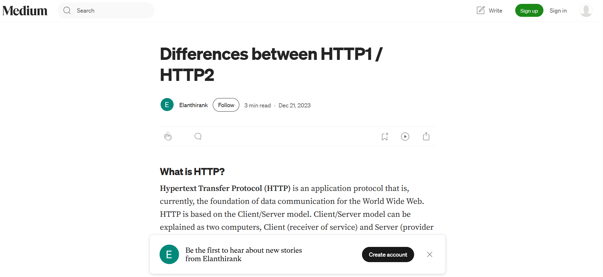
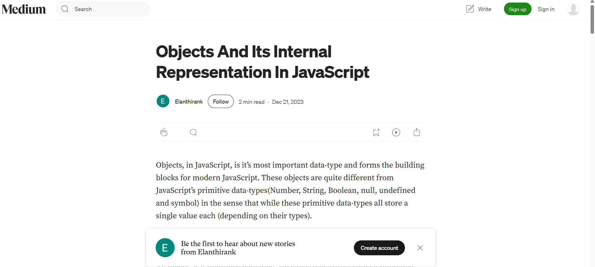

1.**Write a blog on Difference between HTTP1.1 vs HTTP2**
 
  Find the blog link : link https://medium.com/@elanthirank/differences-between-http1-http2-d5ea3aeff6b7

2.**Write a blog about objects and its internal representation in Javascript** 
  
  Find the blog link : link https://medium.com/@elanthirank/objects-and-its-internal-representation-in-javascript-0c72849b2293


# 📖 TASK(HTTP1 vs HTTP2 & JavaScript Objects – Blog Project)

- Differences between **HTTP/1.1 and HTTP/2**
- **Objects in JavaScript** and their internal representation
- More upcoming developer-focused learning notes

---

## 🚀 Features
- 📑 Well-structured technical writeups
- 🔍 Clear explanations with examples
- 🌐 Covers web fundamentals (HTTP) and JavaScript internals
- 📝 Easy-to-read markdown style (ideal for GitHub & Medium)

---

## 📂 Project Structure
.
├── articles/
│ ├── http-differences.md # HTTP1 vs HTTP2
│ ├── javascript-objects.md # Objects in JavaScript
│ └── window-vs-document.md # Window vs Document objects
├── README.md


---

## 📥 Clone
Clone this repository with:
```bash
git clone https://github.com/Elanthiran/TASK.git
cd TASK
```
---

## ⚡ Usage
- Open any .md file inside articles/ to read the blog post.

- You can also copy the markdown content into platforms like Medium, Hashnode, or your personal site.

  ---

## 📸 Screenshots
HTTP1 vs HTTP2 :



JavaScript Objects :



## 🛠️ Tech Stack
- Markdown (.md) for articles

- Medium (optional) for publishing

---

## 🔮 Future Improvements
-Add more blogs on JavaScript, Node.js, and System Design

-Include interactive code snippets with live demo links

-Improve screenshots and visual explanations

---

## 🤝 Contributing
Contributions are welcome!

- Fork the repo

- Add your article in articles/

- Submit a Pull Request

---

## 📜 License
This project is licensed under the MIT License – feel free to use and share the content with attribution.
